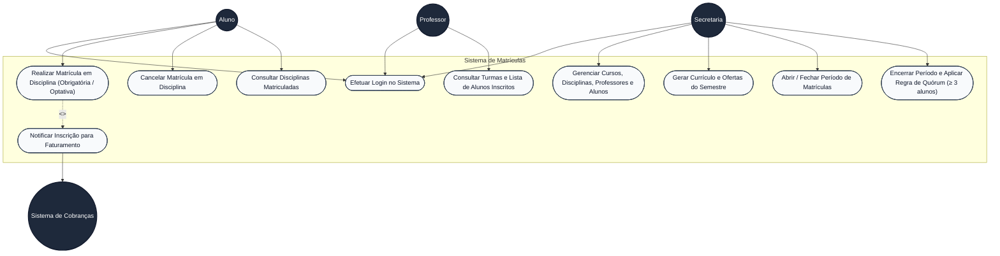
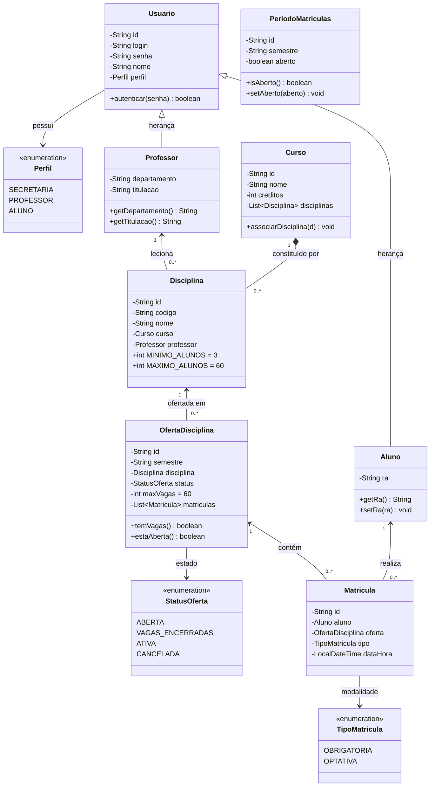

# Sistema de Matrículas — Laboratório de Engenharia de Software

> **Pontifícia Universidade Católica de Minas Gerais (PUC Minas)**  
> **Curso:** Engenharia de Software  
> **Disciplina:** Projeto de Software / Laboratório de Desenvolvimento de Software  
> **Docente:** Profa. Milena Menezes Adão  
> **Autores:** Letícia Figueiredo e Murilo Freitas  

---

## 1. Visão Geral e Especificação do Sistema

O **Sistema de Matrículas** é uma solução completa para a gestão e informatização dos processos de matrículas semestrais da universidade. O sistema atende aos três perfis de atores definidos no projeto (**Secretaria**, **Professor** e **Aluno**), além de integrar-se com o **Sistema de Cobranças**.

### Principais Funcionalidades Atendidas:
- **Secretaria Acadêmica:**
  - Gera o currículo e as ofertas para cada semestre letivo.
  - Mantém e cadastra as informações sobre cursos, disciplinas, professores e alunos.
  - Controla o período de matrículas (abertura/fechamento) e executa o encerramento semestral aplicando a **Regra de Quórum** ($\ge 3$ alunos para ativação de turmas).
- **Alunos:**
  - Realizam matrícula em até **4 disciplinas obrigatórias (1ª opção)** e até **2 disciplinas optativas (alternativas)**.
  - Cancelam matrículas previamente efetuadas enquanto o período de matrículas estiver aberto.
  - Consultam sua grade curricular e limites de inscrição em tempo real.
- **Professores:**
  - Acessam o sistema para consultar quais alunos estão matriculados em cada uma das disciplinas que lecionam.
- **Sistema de Cobranças:**
  - Notificado automaticamente a cada inscrição de aluno no semestre, registrando logs de cobrança e auditoria financeira persistida.
- **Persistência em Disco:**
  - Banco de dados relacional baseado em arquivo (`./data/matriculasdb.mv.db`) com JPA/Hibernate e arquivo de log de auditoria (`./data/cobrancas.log`), preservando o estado entre reinicializações.

---

## 2. Modelagem do Sistema (Lab01S01 & Lab01S02)

### 2.1 Diagrama de Casos de Uso (UML)



---

### 2.2 Histórias de Usuário (User Stories)

#### **US01 — Autenticação de Usuários**
- **Como** Usuário do sistema (Secretaria, Professor ou Aluno),
- **Quero** autenticar-me com login e senha,
- **Para que** eu tenha acesso às funcionalidades e dados restritos ao meu perfil de acesso.
- **Critérios de Aceitação:**
  - O sistema valida as credenciais informadas contra o banco de dados.
  - Ao autenticar com sucesso, gera um token de sessão seguro (JWT).
  - Bloqueia acessos não autorizados a rotas restritas.

#### **US02 — Matrícula em Disciplinas Obrigatórias e Optativas (Aluno)**
- **Como** Aluno regularmente cadastrado,
- **Quero** me inscrever em até 4 disciplinas obrigatórias e até 2 optativas durante o período aberto,
- **Para que** eu possa compor minha grade de estudos para o semestre letivo.
- **Critérios de Aceitação:**
  - O aluno pode selecionar no máximo 4 disciplinas obrigatórias e 2 optativas.
  - O sistema impede a matrícula caso a turma atinja a capacidade máxima de 60 alunos.
  - O sistema impede a matrícula em duplicidade na mesma disciplina.
  - O sistema só permite a operação se o período de matrículas estiver aberto.

#### **US03 — Cancelamento de Matrícula (Aluno)**
- **Como** Aluno matriculado em uma disciplina,
- **Quero** cancelar minha inscrição enquanto o período de matrículas estiver aberto,
- **Para que** eu possa ajustar minha grade semestral conforme minha disponibilidade.
- **Critérios de Aceitação:**
  - O cancelamento libera a vaga imediatamente para outros alunos.
  - A operação é bloqueada caso o período esteja fechado.
  - O evento de cancelamento é registrado no log de auditoria do sistema.

#### **US04 — Notificação ao Sistema de Cobranças**
- **Como** Sistema Acadêmico Integrado,
- **Quero** notificar o Sistema de Cobranças a cada matrícula confirmada de um aluno,
- **Para que** o aluno seja cobrado pelas disciplinas vinculadas ao seu semestre letivo.
- **Critérios de Aceitação:**
  - Cada matrícula gera um registro estruturado no arquivo de persistência `./data/cobrancas.log`.
  - Contém data/hora, dados do aluno (nome, RA, login), disciplina, semestre e modalidade.

#### **US05 — Consulta de Turmas e Alunos (Professor)**
- **Como** Professor da universidade,
- **Quero** visualizar minhas disciplinas atribuídas e a lista dos alunos matriculados,
- **Para que** eu possa acompanhar o preenchimento das turmas e preparar o diário de classe.
- **Critérios de Aceitação:**
  - O professor visualiza apenas as turmas sob sua responsabilidade.
  - Exibe o total de inscritos, indicação de alcance de quórum ($\ge 3$) e a lista de alunos (nome, RA, modalidade).

#### **US06 — Manutenção de Cadastros (Secretaria)**
- **Como** Membro da Secretaria Acadêmica,
- **Quero** cadastrar e manter informações de cursos, disciplinas, professores e alunos,
- **Para que** a universidade mantenha sua estrutura acadêmica atualizada.
- **Critérios de Aceitação:**
  - Permite criar novos cursos especificando nome e créditos.
  - Permite criar disciplinas associando-as ao curso e professor responsável.
  - Permite cadastrar professores e alunos com suas respectivas credenciais.

#### **US07 — Geração do Currículo Semestral (Secretaria)**
- **Como** Secretaria Acadêmica,
- **Quero** gerar ofertas de disciplinas para o semestre letivo,
- **Para que** os alunos possam selecionar as turmas durante o período de matrículas.
- **Critérios de Aceitação:**
  - Cria ofertas para o semestre vigente com limite padrão de 60 vagas.
  - Impede a duplicação da mesma disciplina no mesmo semestre.

#### **US08 — Controle de Períodos e Aplicação da Regra de Quórum (Secretaria)**
- **Como** Secretaria Acadêmica,
- **Quero** abrir, fechar e encerrar o período de matrículas aplicando a regra de quórum,
- **Para que** apenas disciplinas viáveis sejam ministradas no semestre seguinte.
- **Critérios de Aceitação:**
  - Ao alternar o período para fechado, nenhuma nova matrícula ou cancelamento é aceito.
  - Ao encerrar o período: disciplinas com $\ge 3$ alunos tornam-se `ATIVAS`; disciplinas com $< 3$ alunos tornam-se `CANCELADAS`.

---

### 2.3 Diagrama de Classes Estrutural (UML)



---

## 3. Tecnologias Utilizadas

### Backend
- **Java 21 (LTS)**
- **Spring Boot 3.3.3**
  - **Spring Web:** API RESTful desacoplada.
  - **Spring Security:** Autenticação stateless via Bearer Token JWT (JJWT 0.12.6).
  - **Spring Data JPA & Hibernate:** ORM relacional com mapeamento completo de entidades.
  - **H2 Database em Arquivo:** Persistência relacional em disco em `./data/matriculasdb.mv.db`.
  - **Jakarta Bean Validation:** Validação declarativa de entrada de dados.
  - **SLF4J / Logback:** Auditoria financeira em `./data/cobrancas.log`.
- **Maven 3.8+**
- **JUnit 5 & AssertJ:** Testes unitários e de integração automatizados.

### Frontend
- **React 19** com **TypeScript**
- **Vite 6**
- **Tailwind CSS v4**
- **Lucide React**
- **Axios** (com interceptor JWT)
- **React Router DOM v7**

---

## 4. Persistência de Dados e Auditoria

O sistema adota persistência contínua em disco em duas frentes:

1. **Banco de Dados Relacional (`./data/matriculasdb.mv.db`):**
   - Configurado via `jdbc:h2:file:./data/matriculasdb;DB_CLOSE_DELAY=-1;AUTO_SERVER=TRUE`.
   - As alterações feitas na aplicação (novos cadastros de cursos, professores, alunos, matrículas e períodos) persistem no arquivo local mesmo após o encerramento ou reinício da aplicação.
   - O `DatabaseSeeder` verifica a existência prévia de registros antes de popular a base inicial.
2. **Log de Cobrança e Auditoria (`./data/cobrancas.log`):**
   - Registro em formato estruturado a cada matrícula confirmada e cancelada, contendo timestamp, RA, login, nome, disciplina e modalidade.

---

## 5. Como Executar o Projeto

### Pré-requisitos
- **Java JDK 21+** instalado e configurado no terminal.
- **Apache Maven 3.8+** instalado.
- **Node.js 18+** e **npm** instalados.

---

### Passo 1: Iniciar o Backend (Spring Boot)

Na raiz do projeto (`lab02/`):

```bash
mvn spring-boot:run
```

- A API REST estará disponível em: `http://localhost:8080`
- O Console Web do Banco H2 estará disponível em: `http://localhost:8080/h2-console`
  - **JDBC URL:** `jdbc:h2:file:./data/matriculasdb`
  - **User:** `sa`
  - **Password:** *(em branco)*

---

### Passo 2: Iniciar o Frontend (React + Vite)

Em outro terminal, acesse a pasta `frontend/`:

```bash
cd frontend
npm install
npm run dev
```

- A aplicação Web estará disponível no navegador em: `http://localhost:5173`

---

### Passo 3: Executar a Suíte de Testes Automatizados

Na raiz do projeto:

```bash
mvn test
```

> A suíte executa 15 testes automatizados cobrindo autenticação, dashboard, regras de limite de matrícula (4 obrigatórias / 2 optativas), quórum de turmas, lotação máxima de 60 alunos e gestão da secretaria (cursos, professores, alunos e currículo).

---

## 6. Credenciais de Demonstração (Seed Inicial)

O banco é inicializado automaticamente com as seguintes contas:

| Perfil | Login | Senha | Nome do Usuário | Detalhes / Papel |
|---|---|---|---|---|
| **Secretaria** | `secretaria` | `123` | Secretaria Acadêmica | Manutenção de cadastros, controle de período e quórum |
| **Professor** | `prof` | `123` | Profa. Dra. Ana Lima | Docente (Engenharia de Software) |
| **Professor** | `prof2` | `123` | Prof. Me. Carlos Eduardo | Docente (Ciência da Computação) |
| **Aluno** | `aluno1` | `123` | João Silva | RA: 1001 (Engenharia de Software) |
| **Aluno** | `aluno2` | `123` | Maria Souza | RA: 1002 (Engenharia de Software) |
| **Aluno** | `aluno3` | `123` | Pedro Alves | RA: 1003 (Engenharia de Software) |
| **Aluno** | `aluno4` | `123` | Beatriz Costa | RA: 1004 (Engenharia de Software) |

> Na tela de login há botões de preenchimento rápido para testar cada perfil instantaneamente.

---

## 7. Catálogo de Endpoints REST

### Autenticação (`/api/auth`)
- `POST /api/auth/login` — Autenticação de credenciais e geração de JWT.
- `GET /api/auth/me` — Dados cadastrais do usuário autenticado.

### Matrículas e Catálogo (`/api/matriculas` e `/api/ofertas`)
- `GET /api/matriculas/dashboard` — Resumo acadêmico do aluno e contagem de limites.
- `GET /api/matriculas/minhas` — Lista de matrículas ativas do aluno no semestre.
- `POST /api/matriculas` — Realizar inscrição em oferta (`{ ofertaId, tipo }`).
- `DELETE /api/matriculas/{id}` — Cancelar inscrição em disciplina.
- `GET /api/ofertas/disponiveis` — Catálogo de disciplinas com vagas livres e ocupadas.

### Docentes (`/api/professor`)
- `GET /api/professor/turmas` — Lista turmas sob responsabilidade do docente e alunos inscritos.

### Secretaria (`/api/secretaria` e `/api/periodo`)
- `GET /api/secretaria/resumo` — Métricas gerais do sistema acadêmico.
- `GET /api/periodo/atual` — Período letivo ativo e status de abertura.
- `POST /api/periodo/toggle` — Abrir ou fechar o período de matrículas.
- `POST /api/secretaria/encerrar-periodo` — Encerrar o período aplicando quórum ($\ge 3$).
- `GET /api/secretaria/cursos` / `POST /api/secretaria/cursos` — Listar e cadastrar cursos.
- `GET /api/secretaria/disciplinas` / `POST /api/secretaria/disciplinas` — Listar e cadastrar disciplinas.
- `GET /api/secretaria/professores` / `POST /api/secretaria/professores` — Listar e cadastrar professores.
- `GET /api/secretaria/alunos` / `POST /api/secretaria/alunos` — Listar e cadastrar alunos.
- `POST /api/secretaria/ofertas` — Gerar oferta curricular para um semestre.

---

## 8. Estrutura do Repositório

```
lab02/
├── pom.xml                               # Configurações do Maven e dependências Spring Boot
├── README.md                             # Documentação do projeto, diagramas e histórias de usuário
├── data/
│   ├── matriculasdb.mv.db                # Banco de dados relacional H2 persistido em arquivo
│   └── cobrancas.log                     # Arquivo de auditoria do sistema de cobranças
├── src/
│   ├── main/
│   │   ├── java/br/pucminas/matriculas/
│   │   │   ├── config/                   # Segurança (JWT, SecurityConfig, DatabaseSeeder)
│   │   │   ├── controller/               # Controllers REST (Auth, Matricula, Oferta, Periodo, Secretaria, etc.)
│   │   │   ├── dto/                      # Data Transfer Objects
│   │   │   ├── modelo/                   # Entidades JPA (Usuario, Aluno, Professor, Curso, Oferta, etc.)
│   │   │   ├── repository/               # Interfaces Spring Data JPA
│   │   │   └── servico/                  # Camada de regras de negócio e serviços
│   │   └── resources/
│   │       └── application.properties    # Configurações de banco em arquivo, JWT e logs
│   └── test/
│       ├── java/br/pucminas/matriculas/  # Testes automatizados (JUnit 5 + AssertJ)
│       └── resources/                    # application.properties isolado para testes
└── frontend/
    ├── package.json                      # Dependências Node.js
    ├── vite.config.ts                    # Configurações do Vite
    └── src/
        ├── components/                   # Sidebar, Header, AppLayout, ProtectedRoute
        ├── context/                      # Contexto de Autenticação (AuthContext)
        ├── pages/                        # Telas (Login, DashboardAluno, Matricula, Professor, Secretaria)
        ├── services/                     # Configuração Axios e cliente de API
        └── types/                        # Definições de tipos TypeScript
```
