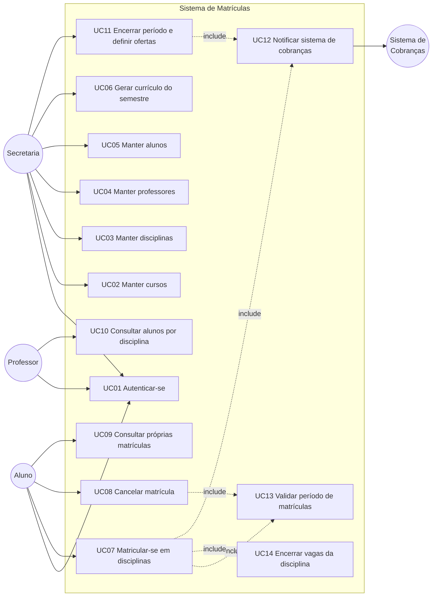
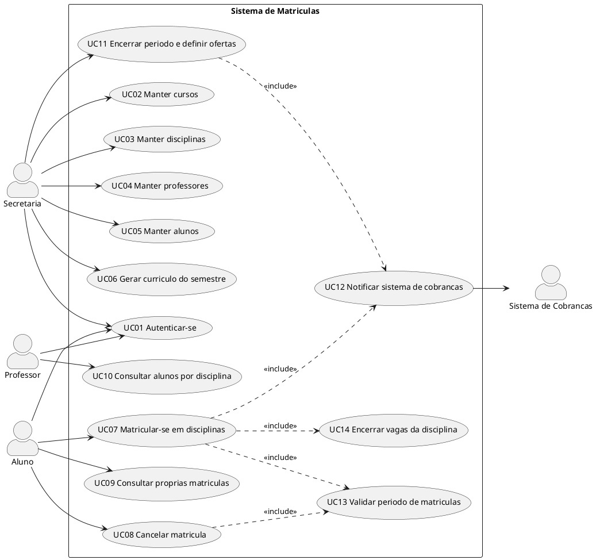

# Diagrama de Casos de Uso — Sistema de Matrículas

Universidade informatiza o processo de matrículas. A secretaria gera o currículo do semestre e mantém cursos, disciplinas, professores e alunos. Alunos matriculam-se (até 4 obrigatórias e 2 optativas) e podem cancelar matrículas **somente no período de matrículas**. Disciplinas só ocorrem no semestre seguinte se tiverem **pelo menos 3** inscritos; o teto é **60** alunos. Após a inscrição do aluno no semestre, o **sistema de cobranças** é notificado. Professores consultam a lista de alunos por disciplina. Todo acesso exige login com senha.

## Atores

| Ator | Tipo | Responsabilidade |
|------|------|------------------|
| Secretaria | Primário | Gera o currículo do semestre e mantém informações de cursos, disciplinas, professores e alunos |
| Aluno | Primário | Matricula-se e cancela matrículas no período permitido |
| Professor | Primário | Consulta alunos matriculados em cada disciplina |
| Sistema de Cobranças | Secundário (externo) | Recebe notificação para cobrar o aluno pelas disciplinas do semestre |

## Diagrama (Mermaid)

## Diagrama UML (PlantUML)

Arquivo equivalente: [`diagrama-casos-de-uso.puml`](./diagrama-casos-de-uso.puml). Pode ser renderizado em [PlantUML](https://www.plantuml.com/plantuml/uml/) ou em editores com extensão PlantUML.

## Relacionamentos

- **Include UC13** em UC07 e UC08: matrícula e cancelamento só ocorrem no período de matrículas.
- **Include UC14** em UC07: ao atingir 60 alunos, novas inscrições naquela disciplina são recusadas.
- **Include UC12** em UC07: após o aluno inscrever-se no semestre, o sistema de cobranças é notificado.
- **Include UC12** em UC11: ao fechar o período, cobranças podem ser alinhadas às disciplinas que permaneceram ativas (mínimo de 3 alunos) e às que foram canceladas.

## Catálogo de casos de uso

| ID | Caso de uso | Ator principal | Resumo |
|----|-------------|----------------|--------|
| UC01 | Autenticar-se | Secretaria, Aluno, Professor | Validar login e senha antes de qualquer operação |
| UC02 | Manter cursos | Secretaria | Cadastrar e atualizar curso (nome, créditos e disciplinas) |
| UC03 | Manter disciplinas | Secretaria | Cadastrar e atualizar disciplinas do currículo |
| UC04 | Manter professores | Secretaria | Cadastrar e atualizar professores |
| UC05 | Manter alunos | Secretaria | Cadastrar e atualizar alunos |
| UC06 | Gerar currículo do semestre | Secretaria | Montar a oferta de disciplinas do semestre |
| UC07 | Matricular-se em disciplinas | Aluno | Inscrever-se em até 4 obrigatórias e 2 optativas |
| UC08 | Cancelar matrícula | Aluno | Desfazer inscrição feita no período vigente |
| UC09 | Consultar próprias matrículas | Aluno | Ver disciplinas em que está inscrito |
| UC10 | Consultar alunos por disciplina | Professor | Listar alunos matriculados em cada disciplina |
| UC11 | Encerrar período e definir ofertas | Secretaria | Fechar matrículas; ativar disciplina se ≥ 3 inscritos, senão cancelar |
| UC12 | Notificar sistema de cobranças | Sistema | Informar cobranças das disciplinas do semestre do aluno |
| UC13 | Validar período de matrículas | Sistema | Impedir matrícula/cancelamento fora da janela |
| UC14 | Encerrar vagas da disciplina | Sistema | Encerrar inscrições da disciplina ao atingir 60 alunos |

As histórias de usuário correspondentes estão em [`historias-de-usuario.md`](./historias-de-usuario.md).
