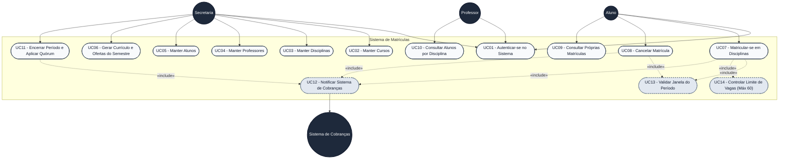

# Diagrama de Casos de Uso — Sistema de Matrículas

O Sistema de Matrículas informatiza o processo acadêmico da universidade atendendo à Secretaria, Professores e Alunos, com integração ao Sistema de Cobranças.

---

## 1. Diagrama de Casos de Uso (UML / Mermaid)

```mermaid
graph TD
    classDef actorStyle fill:#1e293b,stroke:#0f172a,stroke-width:2px,color:#fff;
    classDef useCaseStyle fill:#f8fafc,stroke:#334155,stroke-width:1.5px,color:#0f172a;
    classDef externalStyle fill:#e2e8f0,stroke:#64748b,stroke-width:1.5px,stroke-dasharray: 4 4,color:#0f172a;

    Aluno(("Aluno")):::actorStyle
    Professor(("Professor")):::actorStyle
    Secretaria(("Secretaria")):::actorStyle
    Cobranca(("Sistema de Cobranças")):::actorStyle

    subgraph Sistema de Matrículas
        UC01(["UC01 - Autenticar-se no Sistema"]):::useCaseStyle
        UC02(["UC02 - Manter Cursos"]):::useCaseStyle
        UC03(["UC03 - Manter Disciplinas"]):::useCaseStyle
        UC04(["UC04 - Manter Professores"]):::useCaseStyle
        UC05(["UC05 - Manter Alunos"]):::useCaseStyle
        UC06(["UC06 - Gerar Currículo e Ofertas do Semestre"]):::useCaseStyle
        UC07(["UC07 - Matricular-se em Disciplinas"]):::useCaseStyle
        UC08(["UC08 - Cancelar Matrícula"]):::useCaseStyle
        UC09(["UC09 - Consultar Próprias Matrículas"]):::useCaseStyle
        UC10(["UC10 - Consultar Alunos por Disciplina"]):::useCaseStyle
        UC11(["UC11 - Encerrar Período e Aplicar Quórum"]):::useCaseStyle
        UC12(["UC12 - Notificar Sistema de Cobranças"]):::externalStyle
        UC13(["UC13 - Validar Janela do Período"]):::externalStyle
        UC14(["UC14 - Controlar Limite de Vagas (Máx 60)"]):::externalStyle
    end

    %% Acessos Aluno
    Aluno --> UC01
    Aluno --> UC07
    Aluno --> UC08
    Aluno --> UC09

    %% Acessos Professor
    Professor --> UC01
    Professor --> UC10

    %% Acessos Secretaria
    Secretaria --> UC01
    Secretaria --> UC02
    Secretaria --> UC03
    Secretaria --> UC04
    Secretaria --> UC05
    Secretaria --> UC06
    Secretaria --> UC11

    %% Relacionamentos de Inclusão
    UC07 -.->|«include»| UC13
    UC07 -.->|«include»| UC14
    UC07 -.->|«include»| UC12
    UC08 -.->|«include»| UC13
    UC08 -.->|«include»| UC12
    UC11 -.->|«include»| UC12

    %% Notificações externas
    UC12 --> Cobranca
```

---

## 2. Atores

| Ator | Tipo | Responsabilidade |
|------|------|------------------|
| **Secretaria** | Primário | Gerencia cadastros (cursos, disciplinas, professores, alunos), gera ofertas semestrais e encerra períodos aplicando quórum. |
| **Aluno** | Primário | Realiza e cancela matrículas (até 4 obrigatórias e 2 optativas) durante o período aberto e consulta sua grade. |
| **Professor** | Primário | Consulta as turmas sob sua responsabilidade e a lista de alunos inscritos. |
| **Sistema de Cobranças** | Secundário (Externo) | Recebe notificações de faturamento a cada matrícula/cancelamento para emissão de cobranças acadêmicas. |

---

## 3. Relacionamentos e Regras de Inclusão

- **«include» UC13 (Validar Janela do Período):** As ações de matricular-se (UC07) e cancelar matrícula (UC08) só podem ser executadas quando o período de matrículas estiver aberto.
- **«include» UC14 (Controlar Limite de Vagas):** A matrícula (UC07) verifica se a oferta atingiu 60 inscritos. Atingindo o teto, novas inscrições são bloqueadas.
- **«include» UC12 (Notificar Sistema de Cobranças):** Disparado automaticamente na matrícula (UC07), no cancelamento voluntário (UC08) e no encerramento de período (UC11), gravando os eventos no log financeiro `./data/cobrancas.log`.

---

## 4. Catálogo de Casos de Uso

| ID | Caso de Uso | Ator Principal | Resumo da Operação |
|----|-------------|----------------|--------------------|
| **UC01** | Autenticar-se | Secretaria, Aluno, Professor | Valida login e senha gerando token JWT de sessão. |
| **UC02** | Manter cursos | Secretaria | Cadastra e lista cursos com nome, créditos e disciplinas associadas. |
| **UC03** | Manter disciplinas | Secretaria | Cadastra e lista disciplinas vinculadas a curso e professor responsável. |
| **UC04** | Manter professores | Secretaria | Cadastra docentes com departamento, titulação e credenciais. |
| **UC05** | Manter alunos | Secretaria | Cadastra discentes com RA, curso e credenciais de acesso. |
| **UC06** | Gerar currículo do semestre | Secretaria | Disponibiliza ofertas de disciplinas para inscrição semestral com limite de vagas. |
| **UC07** | Matricular-se em disciplinas | Aluno | Seleciona disciplinas (até 4 obrigatórias e 2 optativas) respeitando limites. |
| **UC08** | Cancelar matrícula | Aluno | Cancela inscrição previamente efetuada no semestre ativo. |
| **UC09** | Consultar próprias matrículas | Aluno | Visualiza grade semestral, disciplinas ativas e status financeiro. |
| **UC10** | Consultar alunos por disciplina | Professor | Lista turmas e alunos matriculados para acompanhamento de diário. |
| **UC11** | Encerrar período e aplicar quórum | Secretaria | Encerra inscrições; turmas com $\ge 3$ alunos tornam-se ATIVAS, turmas $< 3$ são CANCELADAS. |
| **UC12** | Notificar sistema de cobranças | Sistema | Registra operações financeiras no log estruturado de faturamento. |
| **UC13** | Validar janela do período | Sistema | Bloqueia modificações de matrícula fora do período permitido. |
| **UC14** | Encerrar vagas da disciplina | Sistema | Encerra inscrições ao atingir o teto de 60 alunos por turma. |

> Detalhes dos critérios de aceite e fluxos em [`historias-de-usuario.md`](./historias-de-usuario.md).
