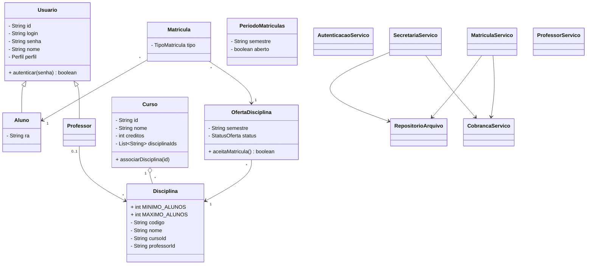

# Diagrama de Classes — Sistema de Matrículas

Alinhado à implementação Java em `src/main/java`.

Camadas: `modelo` (domínio) → `servico` (regras) → `ui` (terminal) → `persistencia` (arquivos CSV em `data/`).
