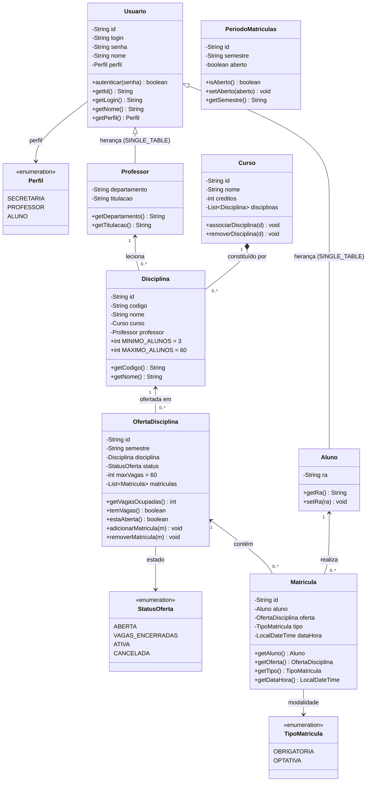
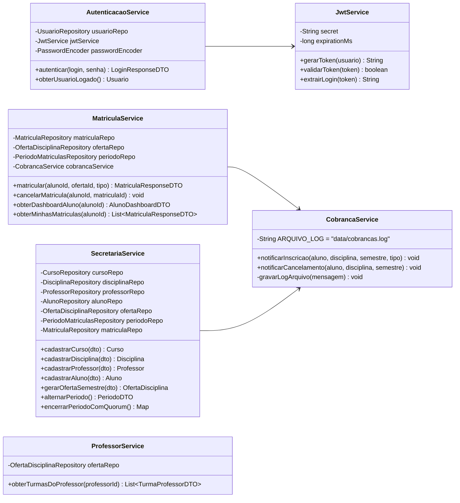

# Diagrama de Classes — Sistema de Matrículas

Diagrama estrutural do sistema em conformidade com a arquitetura implementada em Spring Boot 3, JPA/Hibernate e TypeScript/React.

## 1. Diagrama de Classes de Domínio (Entidades JPA)


```mermaid
classDiagram
    direction TB

    class Perfil {
        <<enumeration>>
        SECRETARIA
        PROFESSOR
        ALUNO
    }

    class StatusOferta {
        <<enumeration>>
        ABERTA
        VAGAS_ENCERRADAS
        ATIVA
        CANCELADA
    }

    class TipoMatricula {
        <<enumeration>>
        OBRIGATORIA
        OPTATIVA
    }

    class Usuario {
        -String id
        -String login
        -String senha
        -String nome
        -Perfil perfil
        +autenticar(senha) boolean
        +getId() String
        +getLogin() String
        +getNome() String
        +getPerfil() Perfil
    }

    class Aluno {
        -String ra
        +getRa() String
        +setRa(ra) void
    }

    class Professor {
        -String departamento
        -String titulacao
        +getDepartamento() String
        +getTitulacao() String
    }

    class Curso {
        -String id
        -String nome
        -int creditos
        -List~Disciplina~ disciplinas
        +associarDisciplina(d) void
        +removerDisciplina(d) void
    }

    class Disciplina {
        -String id
        -String codigo
        -String nome
        -Curso curso
        -Professor professor
        +int MINIMO_ALUNOS = 3
        +int MAXIMO_ALUNOS = 60
        +getCodigo() String
        +getNome() String
    }

    class OfertaDisciplina {
        -String id
        -String semestre
        -Disciplina disciplina
        -StatusOferta status
        -int maxVagas = 60
        -List~Matricula~ matriculas
        +getVagasOcupadas() int
        +temVagas() boolean
        +estaAberta() boolean
        +adicionarMatricula(m) void
        +removerMatricula(m) void
    }

    class Matricula {
        -String id
        -Aluno aluno
        -OfertaDisciplina oferta
        -TipoMatricula tipo
        -LocalDateTime dataHora
        +getAluno() Aluno
        +getOferta() OfertaDisciplina
        +getTipo() TipoMatricula
        +getDataHora() LocalDateTime
    }

    class PeriodoMatriculas {
        -String id
        -String semestre
        -boolean aberto
        +isAberto() boolean
        +setAberto(aberto) void
        +getSemestre() String
    }

    Usuario <|-- Aluno : herança (SINGLE_TABLE)
    Usuario <|-- Professor : herança (SINGLE_TABLE)
    Usuario --> Perfil : perfil

    Curso "1" *-- "0..*" Disciplina : constituído por
    Professor "1" <-- "0..*" Disciplina : leciona
    Disciplina "1" <-- "0..*" OfertaDisciplina : ofertada em
    OfertaDisciplina --> StatusOferta : estado

    Aluno "1" <-- "0..*" Matricula : realiza
    OfertaDisciplina "1" <-- "0..*" Matricula : contém
    Matricula --> TipoMatricula : modalidade
```

---

## 2. Diagrama de Serviços e Camada de Aplicação


```mermaid
classDiagram
    direction LR

    class AutenticacaoService {
        -UsuarioRepository usuarioRepo
        -JwtService jwtService
        -PasswordEncoder passwordEncoder
        +autenticar(login, senha) LoginResponseDTO
        +obterUsuarioLogado() Usuario
    }

    class MatriculaService {
        -MatriculaRepository matriculaRepo
        -OfertaDisciplinaRepository ofertaRepo
        -PeriodoMatriculasRepository periodoRepo
        -CobrancaService cobrancaService
        +matricular(alunoId, ofertaId, tipo) MatriculaResponseDTO
        +cancelarMatricula(alunoId, matriculaId) void
        +obterDashboardAluno(alunoId) AlunoDashboardDTO
        +obterMinhasMatriculas(alunoId) List~MatriculaResponseDTO~
    }

    class SecretariaService {
        -CursoRepository cursoRepo
        -DisciplinaRepository disciplinaRepo
        -ProfessorRepository professorRepo
        -AlunoRepository alunoRepo
        -OfertaDisciplinaRepository ofertaRepo
        -PeriodoMatriculasRepository periodoRepo
        -MatriculaRepository matriculaRepo
        +cadastrarCurso(dto) Curso
        +cadastrarDisciplina(dto) Disciplina
        +cadastrarProfessor(dto) Professor
        +cadastrarAluno(dto) Aluno
        +gerarOfertaSemestre(dto) OfertaDisciplina
        +alternarPeriodo() PeriodoDTO
        +encerrarPeriodoComQuorum() Map
    }

    class ProfessorService {
        -OfertaDisciplinaRepository ofertaRepo
        +obterTurmasDoProfessor(professorId) List~TurmaProfessorDTO~
    }

    class CobrancaService {
        -String ARQUIVO_LOG = "data/cobrancas.log"
        +notificarInscricao(aluno, disciplina, semestre, tipo) void
        +notificarCancelamento(aluno, disciplina, semestre) void
        -gravarLogArquivo(mensagem) void
    }

    class JwtService {
        -String secret
        -long expirationMs
        +gerarToken(usuario) String
        +validarToken(token) boolean
        +extrairLogin(token) String
    }

    AutenticacaoService --> JwtService
    MatriculaService --> CobrancaService
    SecretariaService --> CobrancaService
```

---

## 3. Mapeamento de Camadas da Arquitetura

```
┌─────────────────────────────────────────────────────────────┐
│                   Frontend (React 19 / Vite)                │
│       Pages (Login, DashboardAluno, Matricula, etc.)        │
└──────────────────────────────┬──────────────────────────────┘
                               │ HTTP / JSON (REST + JWT)
┌──────────────────────────────▼─────────────────────────────┐
│                 Controllers REST (Spring Web)               │
│   AuthController | MatriculaController | SecretariaController│
└──────────────────────────────┬──────────────────────────────┘
                               │ Injeção de Dependências
┌──────────────────────────────▼─────────────────────────────┐
│                 Camada de Serviços de Negócio               │
│  AutenticacaoService | MatriculaService | SecretariaService │
│          ProfessorService | CobrancaService                 │
└──────────────┬──────────────────────────────┬──────────────┘
               │                              │
┌──────────────▼─────────────┐ ┌──────────────▼──────────────┐
│  Spring Data JPA Repos     │ │   Auditoria Financeira       │
│  (H2: ./data/matriculasdb) │ │   (./data/cobrancas.log)     │
└────────────────────────────┘ └─────────────────────────────┘
```
